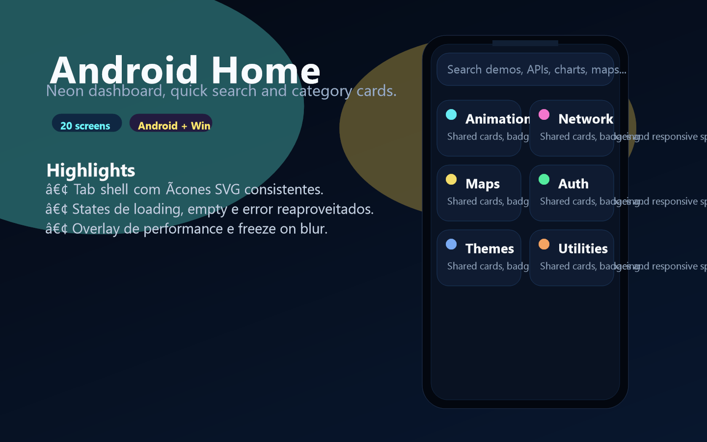
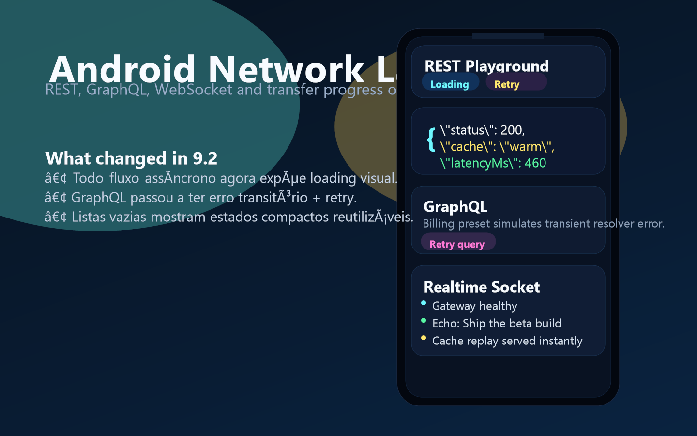
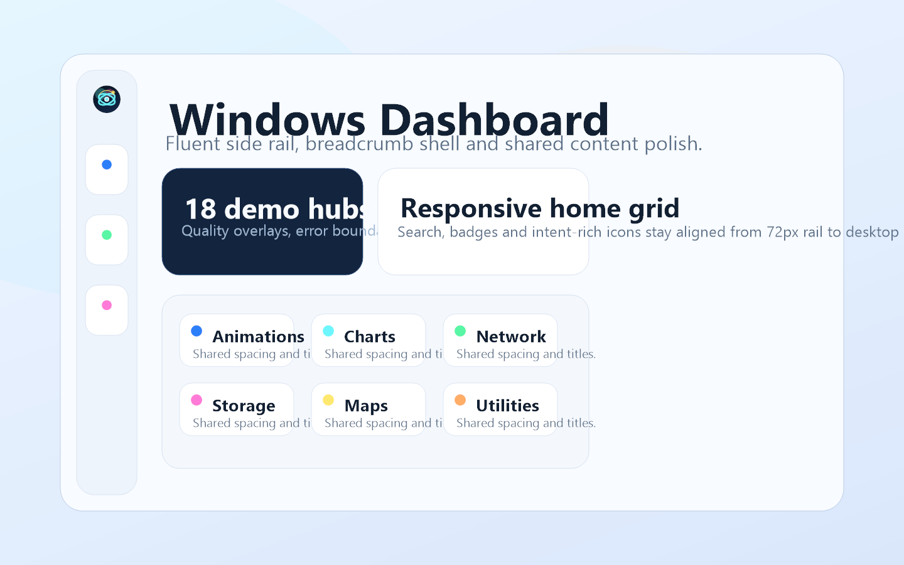
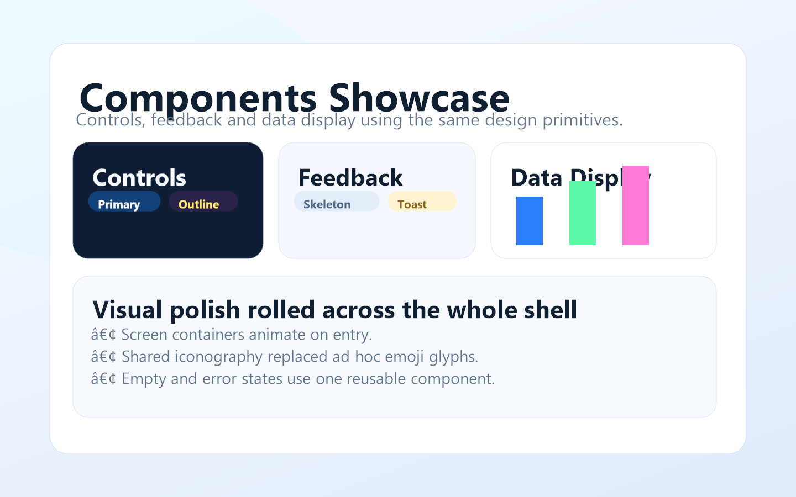

# React Showcase

Portfólio cross-platform em React Native com duas variantes focadas em apresentação visual:

- `React Android`: shell mobile com tabs, splash e temas neon.
- `React Windows`: shell desktop com side rail Fluent e branding próprio.

## Demo










## Estrutura

- [SHOWCASE_PLAN.md](SHOWCASE_PLAN.md): roadmap macro e status por fase.
- `scripts/generate-showcase-assets.ps1`: regenera ícones, splash e peças de marketing.
- `scripts/build-android-release.ps1`: empacota `APK` e `AAB` quando Java/Android SDK estão disponíveis.
- `scripts/build-windows-release.ps1`: empacota `AppX/MSIX` quando Visual Studio/MSBuild estão instalados.

## Desenvolvimento

### Android

```powershell
cd "React Android"
npm install
npm start
npm run android
```

### Windows

```powershell
cd "React Windows"
npm install
npm start
npm run windows
```

## Branding e Marketing

Regenerar todos os assets visuais:

```powershell
powershell -ExecutionPolicy Bypass -File .\scripts\generate-showcase-assets.ps1
```

Saídas geradas:

- `React Android/android/app/src/main/res/mipmap-*/ic_launcher*.png`
- `React Android/android/app/src/main/res/drawable/launch_screen.xml`
- `React Windows/windows/CFDWindows/Assets/*.png`
- `docs/marketing/*.png`
- `docs/marketing/showcase-demo.gif`

## Release

### Android

Pré-requisitos:

- JDK 17+
- Android SDK configurado no `PATH`
- Gradle wrapper do projeto

Comandos:

```powershell
cd "React Android"
npm run assets:brand
npm run release:apk
npm run release:aab
```

Artefatos esperados em `artifacts/android/`.

### Windows

Pré-requisitos:

- Visual Studio 2022
- workload UWP/Desktop C++
- toolchain React Native Windows

Comando:

```powershell
cd "React Windows"
npm run assets:brand
npm run release:windows:appx
```

Artefatos esperados em `artifacts/windows/`.

## Qualidade

- TypeScript limpo nas duas plataformas.
- Testes unitários, snapshots e layout tests ativos.
- Error boundaries, overlay de performance/FPS e shell visual compartilhado.

## Observações

- O ambiente atual pode não ter `java` ou `msbuild`; por isso os scripts de release falham cedo com mensagem objetiva quando a toolchain não estiver instalada.
- O demo reel em `GIF` serve como asset de marketing leve para README e documentação.
